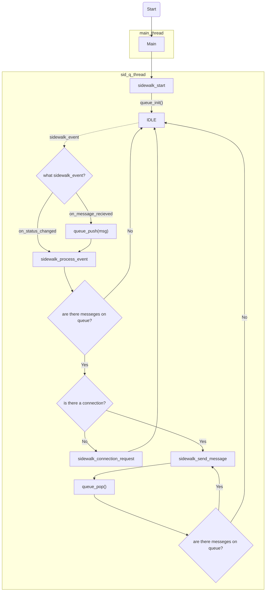

# Ping Bluetooth LE

## Reqirements

The sample supports the following development kits:

|Hardware platforms|PCA|Board name|Build target|
|---|---|---|---|
|nrf52840 DK|PCA10056|nrf52840dk_nrf52840|nrf52840dk_nrf52840|
|nrf5340 DK|PCA10095|nrf5340dk_nrf5340|nrf5340dk_nrf5340_cpuapp|

---

## Overview

The sample sends the message to aws it recieves with use of Bluetooth LE. The sample also sends a message to aws when it connects for the first time.

---

## Building and running

## Sample process

Sample can be found in the directory where this file first was.

> [!NOTE]
>
> Before you flash you Sidewalk sample, make sure you completed the following:
> * You downloaded the Sidewalk repository and updated west according to the [Downloading the Sidewalk repository](https://nrfconnect.github.io/sdk-sidewalk/setting_up_sidewalk_environment/setting_up_sdk.html#dk-building-sample-app) section.
> * You provisioned your device during the [Setting up your Sidewalk product](https://nrfconnect.github.io/sdk-sidewalk/setting_up_sidewalk_environment/setting_up_sidewalk_product.html#setting-up-sidewalk-product).
> 
> This step needs to be completed only once. You do not have to repeat it on every sample rebuild.

To build the sample, follow the steps in the [Building and programming an application](#) documentation. 

This application can be built as follows:

```
west build -b <supported_build_target> <path_to_the_sample>
```

If path to the sample is left empty it defaults to the folder you're currently in 

Example:

```
west build -b nrf52840dk_nrf52840
```

