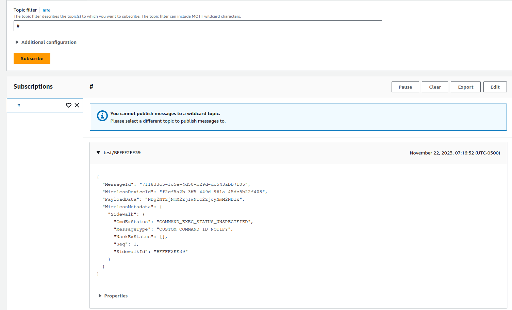

# Ping Bluetooth LE

## Reqirements

The sample supports the following development kits:

|Hardware platforms|PCA|Board name|Build target|
|---|---|---|---|
|nrf52840 DK|PCA10056|nrf52840dk_nrf52840|nrf52840dk_nrf52840|
|nrf5340 DK|PCA10095|nrf5340dk_nrf5340|nrf5340dk_nrf5340_cpuapp|

---

## Overview

The sample sends the message to AWS MQTT it recieves with use of Bluetooth LE. The sample also sends a message to AWS MQTT when it connects for the first time.

---

## Building and running


Sample can be found in the directory where this file first was.

> [!NOTE]
>
> Before you flash you Sidewalk sample, make sure you completed the following:
> * You downloaded the Sidewalk repository and updated west according to the [Downloading the Sidewalk repository](https://nrfconnect.github.io/sdk-sidewalk/setting_up_sidewalk_environment/setting_up_sdk.html#dk-building-sample-app) section.
> * You provisioned your device during the [Setting up your Sidewalk product](https://nrfconnect.github.io/sdk-sidewalk/setting_up_sidewalk_environment/setting_up_sidewalk_product.html#setting-up-sidewalk-product).
> 
> This step needs to be completed only once. You do not have to repeat it on every sample rebuild.

To build the sample, follow the steps in the [Building and programming an application](https://developer.nordicsemi.com/nRF_Connect_SDK/doc/2.5.0/nrf/getting_started/programming.html#gs-programming) documentation. 

This application can be built as follows:

```
west build -b <supported_build_target> <path_to_the_sample>
```

If path to the sample is left empty it defaults to the folder you're currently in 

Example:

```
west build -b nrf52840dk_nrf52840
```

### Sample process

The sample works as follows:


> [!NOTE]
>
> Before testing or running the sample make sure you're subscribed to the correct topic
> 

### Testing

See [Testing and debugging an application](https://developer.nordicsemi.com/nRF_Connect_SDK/doc/2.5.0/nrf/getting_started/testing.html#gs-testing) for information on testing and debugging in the nRF Connect SDK.

After successfully building the sample and flashing manufacturing data, the sample is ready to use. To refresh the logs, restart the program by pressing the RESET button on your development kit. You should see the following output:

```
*** Booting nRF Connect SDK v2.5.0 ***
----------------------------------------------------------------
nrf                  v2.5.0
zephyr               v3.4.99-ncs1-dirty
sidewalk             v2.5.0-dirty
----------------------------------------------------------------
sidewalk_fork_point = 0000000000000000000000000000000000000000
build time          = 2023-11-22 10:13:01.668906+00:00
----------------------------------------------------------------
[00:00:00.325,073] <inf> sid_ble: Enable BT
[00:00:00.340,118] <inf> bt_hci_core: HW Platform: Nordic Semiconductor (0x0002)
[00:00:00.340,148] <inf> bt_hci_core: HW Variant: nRF53x (0x0003)
[00:00:00.340,179] <inf> bt_hci_core: Firmware: Standard Bluetooth controller (0x00) Version 197.47763 Build 2370639017
[00:00:00.408,966] <inf> bt_hci_core: Identity: E2:83:09:64:6C:7B (random)
[00:00:00.409,027] <inf> bt_hci_core: HCI: version 5.4 (0x0d) revision 0x2102, manufacturer 0x0059
[00:00:00.409,057] <inf> bt_hci_core: LMP: version 5.4 (0x0d) subver 0x2102
[00:00:00.409,057] <inf> sid_ble: BT initialized
[00:00:00.414,672] <dbg> sid_callbacks: on_sidewalk_status_changed: on status changed: 1
[00:00:00.414,703] <inf> work: SIDEWALK STARTED 0
```

Wait for the device to complete the [Automatic Touchless Registration using Sidewalk FFN](https://nrfconnect.github.io/sdk-sidewalk/testing_samples/sidewalk_automatic_registration.html#automatic-registration-sidewalk-endpoints).

### Starting Sidewalk

To start Sidewalk, do the following:

1. Connect your Nordic device to the PC through USB. Set the power switch on the device to ON.

2. Flash the sample application with the manufacturing data as described in the Building and running section of the respective sample.

    You should see the following logs:
    
    ```
    *** Booting nRF Connect SDK v2.5.0 ***
    ----------------------------------------------------------------
    nrf                  v2.5.0
    zephyr               v3.4.99-ncs1-dirty
    sidewalk             v2.5.0-dirty
    ----------------------------------------------------------------
    sidewalk_fork_point = 0000000000000000000000000000000000000000
    build time          = 2023-11-22 10:13:01.668906+00:00
    ----------------------------------------------------------------
    [00:00:00.325,408] <inf> sid_ble: Enable BT
    [00:00:00.340,423] <inf> bt_hci_core: HW Platform: Nordic Semiconductor (0x0002)
    [00:00:00.340,454] <inf> bt_hci_core: HW Variant: nRF53x (0x0003)
    [00:00:00.340,484] <inf> bt_hci_core: Firmware: Standard Bluetooth controller (0x00) Version 197.47763 Build 2370639017
    [00:00:00.409,362] <inf> bt_hci_core: Identity: E2:83:09:64:6C:7B (random)
    [00:00:00.409,393] <inf> bt_hci_core: HCI: version 5.4 (0x0d) revision 0x2102, manufacturer 0x0059
    [00:00:00.409,423] <inf> bt_hci_core: LMP: version 5.4 (0x0d) subver 0x2102
    [00:00:00.409,423] <inf> sid_ble: BT initialized
    [00:00:00.415,069] <dbg> sid_callbacks: on_sidewalk_status_changed: on status changed: 1
    [00:00:00.415,069] <inf> work: SIDEWALK STARTED 0
    ```

3. Wait for the device to perform registration and time syncronisation

    You should see the following logs:

    ```
    [00:00:03.061,248] <inf> sid_ble_conn: BT Connected
    [00:00:03.711,029] <dbg> sid_callbacks: on_sidewalk_status_changed: on status changed: 0
    [00:00:03.748,931] <inf> sid_ble_conn: BT Disconnected Reason: 0x16 = LOCALHOST_TERM_CONN
    [00:00:03.756,347] <dbg> sid_callbacks: on_sidewalk_status_changed: on status changed: 1
    ```

4. Wait for the application to send its introduction message

    You should see the following logs:

    ```
    # Logs from DK
    [00:00:05.407,470] <inf> sid_ble_conn: BT Connected
    [00:00:06.065,399] <dbg> sid_callbacks: on_sidewalk_status_changed: on status changed: 0
    [00:00:06.068,969] <inf> work: queued data message id:1
    [00:00:06.100,891] <dbg> sid_callbacks: on_sidewalk_msg_sent: on message sent   

    # Logs from MQTT
    {
        "MessageId": "649dd30a-4d3a-4d57-b357-1fa48d6d88a9",
        "WirelessDeviceId": "f2cf5a2b-3ff5-449d-961a-45dc5b22f408",
        "PayloadData": "NDg2NTZjNmM2ZjIwNTc2ZjcyNmM2NDIx",
        "WirelessMetadata": {
            "Sidewalk": {
            "CmdExStatus": "COMMAND_EXEC_STATUS_UNSPECIFIED",
            "MessageType": "CUSTOM_COMMAND_ID_NOTIFY",
            "NackExStatus": [],
            "Seq": 1,
            "SidewalkId": "BFFFF2EE39"
            }
        }
    }   
    ```

    You can decode the message in payload data with python

    ```
    python -c "import sys,base64;print(bytes.fromhex(base64.b64decode(sys.argv[1].encode('utf-8')).decode('utf-8')).decode('ASCII'))" <PayloadData>
    ```

    or with the use of bash base64

    ```
    base64 -d <<< <PayloadData> | xxd -r -p
    ```

### Sending and recieving the message to AWS MQTT

1. To be able to use AWS CLI, ensure you completed steps in the [Installing or updating the latest version of the AWS CLI](https://docs.aws.amazon.com/cli/latest/userguide/getting-started-install.html) documentation.
2. Run the following command to send a message to your Sidewalk Endpoint:
    ```
    aws iotwireless send-data-to-wireless-device --id=<wireless_device_id> --transmit-mode 0 --payload-data="<payload_data>" --wireless-metadata "Sidewalk={Seq=<sequence_number>}"
    ```
    * `<wireless_device_id>` is the Wireless Device ID of your Sidewalk Device.
        
        You can find it in the WirelessDevice.json file, generated with the Nordic_MFG.hex file during [Setting up your Sidewalk product](https://nrfconnect.github.io/sdk-sidewalk/setting_up_sidewalk_environment/setting_up_sidewalk_product.html#setting-up-sidewalk-product).

        You can also find your Wireless Device ID in the message sent form the device to AWS.

    * `<payload_data>` is base64 encoded.

        To prepare a message payload in the base64 format, run:

        ```
        python -c "import sys,base64;print(base64.b64encode(sys.argv[1].encode('utf-8')).decode('utf-8'))" "<Your_message>"
        ```

        or (for bash):

        ```
        base64 <<< "<Your_message>"
        ```
    * `<sequence_number>` is an integer and should be different for each subsequent request.
        
> [!NOTE]
>
> Ensure to increase 'Seq' number on every message. The device will not receive a message with lower or equal sequence number.
>
> 'Seq' must be higher than 1

    Once you have populated the command with data, it should look similar to the following:

    ```
    aws iotwireless send-data-to-wireless-device --id=f2cf5a2b-3ff5-449d-961a-45dc5b22f408 --transmit-mode 0 --payload-data="SGVsbG8gV29ybGQhCg==" --wireless-metadata "Sidewalk={Seq=2}"
    ```

    Successfully sent response should look as follows:

    ```
    {
        "MessageId": "9b43d1e6-7578-4785-97aa-9c27c7ed150a"
    }
    ```

    Data will be received in Sidewalk logs:

    ```
    [00:00:14.448,059] <dbg> sid_callbacks: on_sidewalk_msg_received: received message(type: 2, link_mode: 1, id: 2 size 13)
    [00:00:14.448,120] <inf> sid_callbacks: Message data: 
                                            48 65 6c 6c 6f 20 57 6f  72 6c 64 21 0a          |Hello Wo rld!.   
    [00:00:14.450,988] <inf> work: queued data message id:2
    ```

3. After sending the message the device should send that message to AWS MQTT. You should see the following logs:

    ```
    # Logs from DK
    [00:00:14.723,541] <dbg> sid_callbacks: on_sidewalk_msg_sent: on message sent

    # Logs from MQTT
    {
        "MessageId": "18b1ac07-8c6a-4f3b-9bff-c8763bf291e6",
        "WirelessDeviceId": "f2cf5a2b-3ff5-449d-961a-45dc5b22f408",
        "PayloadData": "NDg2NTZjNmM2ZjIwNTc2ZjcyNmM2NDIxMGE=",
        "WirelessMetadata": {
            "Sidewalk": {
            "CmdExStatus": "COMMAND_EXEC_STATUS_UNSPECIFIED",
            "MessageType": "CUSTOM_COMMAND_ID_NOTIFY",
            "NackExStatus": [],
            "Seq": 2,
            "SidewalkId": "BFFFF2EE39"
            }
        }
    }
    ```

> [!NOTE]
>
> Logs from DK containing "on status changed: " inform you of the connection status 0 for connected, 1 for not connected